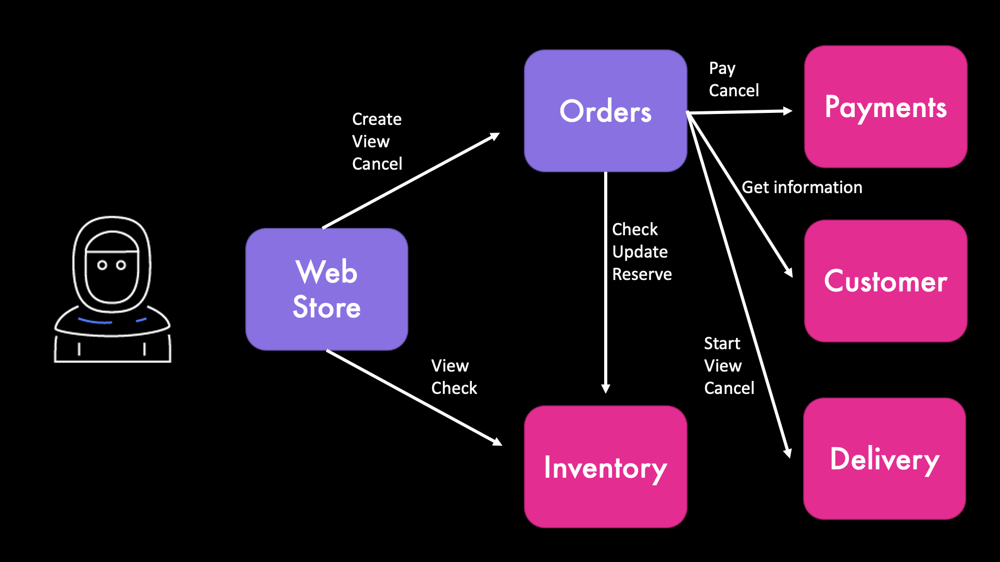

# AWS SAM and AWS EventBridge Advanced Demo

_Infrastructure as code framework used_: AWS SAM

_AWS Services used_: AWS EventBridge, AWS Lambda, AWS DynamoDB, Amazon Location Services

## Summary of the demo

In this demo you will see:

- How to build an event-driven application using Amazon EventBridge and infrastructure as code
- How to add a central logging for all your events
- How to use PartiQL for storing data in DynamoDB
- How to use Lambda Layers for code that is used in multiple microservices.
- How to use API Destinations
- How to add Dead Letter Queues to EventBridge

This demo is part of a video posted in FooBar Serverless channel. You can check the videos to see the whole demo.

Important: this application uses various AWS services and there are costs associated with these services after the Free Tier usage - please see the AWS Pricing page for details. You are responsible for any AWS costs incurred. No warranty is implied in this example.

## Application Architecture



See the flow for all the events in the [events table](event-table.md).

### Services

- Customer - customer information such as name, address, and email
- Order - to create an order orchestrating all other services, and describe the order status
- Inventory - to store inventory information of items to sell
- Payment - to make and cancel payments, it can randomly fail (see Demo below)
- Delivery - to estimate distance and cost of a delivery, and to start, complete, or cancel a delivery

Only for the event-driven scenario:

- Event Store - to store all events

### API Operations

To trigger the create order flow, use this url:

```
GET /order/create/{customerId}/{itemId} #
```

## Get started with this project

### Requirements

- AWS CLI already configured with Administrator permission
- AWS SAM CLI installed - minimum version 1.37.0 (sam --version)
- NodeJS 14.x installed

### Deploy this demo

Start by building and deploying the project. We will be using [AWS SAM](https://docs.aws.amazon.com/serverless-application-model/latest/developerguide/serverless-sam-cli-install.html) and make sure you are running the latest version - at the time of writing, this was 1.32.0 (sam --version):

```bash
sam build -p # Parallel build

sam deploy -g # Guided deployments
```

When deploying for the first time you will need to input an URL. This URL simulates the third party delivery service. For faking this URL you can use the site [Webhook.site](https://webhook.site/). If you want to see the Dead Letter queue in action, you need to input an URL that returns an error (or a non existant URL).

Next times, when you update the code, you can build and deploy with:

```bash
sam build -c -p && sam deploy # Parallel build caching previous builds
```

When asked about functions that may not have authorization defined, answer (y)es. The access to those functions will be open to anyone, so keep the app deployed only for the time you need this demo running. To delete the app:

```bash
sam delete
```

### Prepare the service

Load the sample data in the `data` directory, use the same stack name you entered for `sam deploy`:

```bash
./load.sh <stack-name>
```

### Create your first order

Create an order for `customer-1` buing `item-1` calling the Create Order API:

```
curl -i <API Gateway URL>/order/create/customer-1/item-1
```

From the output of the command, write down the `customerId` and the `orderId`, they together identify a specific order.

## Useful information about the different services of the application

### Inventory service

#### InventoryTable content

Look at the **Items** of the `InventoryTable` in the [DynamoDB console](https://console.aws.amazon.com/dynamodb). The actual name of the table will be in the form `<stack-name>-InventoryTable-<unique-ID>`. Note that the table is empty before the first order is created.

If the order was created successfully, you should have an item with status `DELIVERING`.

### Payments service

#### Payment successful

In case you find the PaymentMade event, the next events are:

- ItemRemoved (from the Inventory service)
- DeliveryStarted (from the Delivery Service)

#### Payment failed

To force a failed payment, you can increase the value of the `PAYMENT_FAIL_PROBABILITY` environment variable in the configuration of the `PaymentFunction` (for example, to `0.9` or `1.0`). You can change the value directly in the Lambda console or in the SAM template (and deploy).

In case you find the `PaymentFailed` event, the next events are:

- `ItemUnreserved` (from the Inventory service)

In the `InventoryTable`, the order has status `PAYMENT_FAILED`.

### Delivery service

#### Completing order delivery

To move forward when a delivery starts, you need to send an event to report if the delivery has been successful (`Delivered`) or not (`DeliveryCancel`).

In the [EventBridge console](https://console.aws.amazon.com/events/), choose **Event buses** and then the `AppEventBus-<stack-name>` custom event bus. Then, choose **Send events**:

- In **Event source**, you can put anything you want (for exmaple, `Logistics`)

- In **Detail type**, you should put either `Delivered` or `DeliveryCanceled`

- In **Event detail**, you need to put a JSON object identifying the order in the format (see the `deliveryEvent.json` file in the `data` directory):

```json
{
  "customerId": "customer-1",
  "orderId": "..."
}
```

After you **Send** the event, new events will appear.

##### Delivered order

If you send the `Delivered` event, these are the new events in the logs:

- `Delivered` (the event you sent form the EventBridge console)
- `DeliveryWasDelivered` (from the Delivery service)
- `OrderDelivered` (from the Order service)

In the `InventoryTable`, the order has status `DELIVERED`.

#### Delivery canceled

If you send the `DeliveryCanceled` event, these are the new events in the logs:

- `DeliveryCanceled` (the event you sent form the EventBridge console)
- `DeliveryWasCanceled` (from the Delivery service)
- `OrderCanceled` (from the Order service)
- `ItemReturned` (from the Inventory service)
- `PaymentCanceled` (from the Payment service)

### Event Store / Event Sourcing - Central logging of events

The `EventStoreFunction` is storing all events in CloudWatch Logs and in the `EventStoreTable` in DynamoDB.

The `EventStoreTable` has a primary ket composed by:

- `who` : `C#<customerId>` – In this way, you can quickly get all info for a customer. Events not related to a customer will use a different initial letter. For example, product updated can set this to `P#<productId>`
- `timeWhat` : `timestamp#eventType`
- `eventSource` : the source of the event
- `eventDetail` : the full JSON of the event as a string

#### EventStoreFunction logs

Look at the logs of the `EventStoreFunction` Lambda function. The actual name of the function will be in the form `<stack-name>-EventStoreFunction-<unique-ID>`. To find the logs, in the [Lambda console](https://console.aws.amazon.com/lambda/), select the function, then the **Monitor** tab, then choose **View logs in CloudWatch**. Note that there are no logs before the first execution of a function.

Close the left pad and choose **View as text**. You can see all the event published by different services processing the order. Now there is only an order. When there are more than one order in the logs, you can filter by `orderId`, for example `"2021-09-29T16:50:20.784Z"`, including the double quotes at the start and at the end.

In order, the events for the order you created are:

- `OrderCreated` (from the Order service)
- `ItemReserved` (from the Inventory service)
- `ItemDescribed` (from the Inventory service)
- `CustomerDescribed` (from the Customer service)
- `DeliveryEstimated` (from the Delivery service)
- `PaymentMade` or `PaymentFailed` (from the Payment service)

The Payment service fails with a probability passed to the Lambda `PaymentFunction` in an environment variable (`PAYMENT_FAIL_PROBABILITY`) that by default has value `0.2` (20% probability to fail). You can edit the variable in the Lambda console.

## Related video tutorials

- [Get started with AMAZON EVENTBRIDGE, build your SERVERLESS event-driven app with AWS SAM](https://youtu.be/c493KFaWteg)
- [What to DO when an EVENT DELIVERY FAILS? - Dead Letter Queues with Amazon EventBridge](https://youtu.be/heJbgToU04c)
- [How to DESIGN EVENT-DRIVEN applications! The best method for production applications!](https://youtu.be/LaxH8GS8l3Q)
- [Centralize all your EVENTS of your EVENT-DRIVEN applications - Amazon EventBridge](https://youtu.be/DGijNsXoMgke)
- [Build Event-driven applications using 3rd party APIs - Amazon EventBridge API Destinations](https://youtu.be/tyNoiravCNw)
- [Build Event-driven applications using 3rd party APIs - Amazon EventBridge API Destinations](https://youtu.be/heJbgToU04c)
- Lambda Layers video - Soon...
